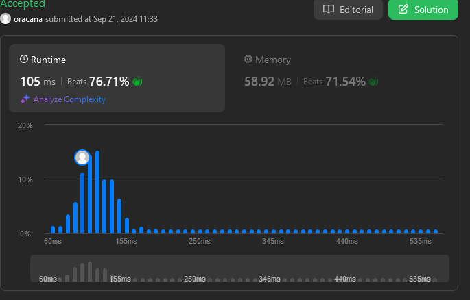

# Leet Code problem 743.Network Delay Time
[Network Delay Time](https://leetcode.com/problems/network-delay-time/description/)

## Constraints 
* Return the minimum time it takes for all the n nodes to receive the signal
* If it is impossible for all the n nodes to receive the signal, return -1
* 1 <= k <= n <= 100
* 1 <= times.length <= 6000
* times[i].length == 3
* 1 <= ui, vi <= n
* ui != vi
* 0 <= wi <= 100
* All the pairs (ui, vi) are unique. (i.e., no multiple edges.)

### Algorithm

### Time Complexity O(m + n log n)
* m = # of edges
* n = # of nodes

#### Graph Construction
* iterating over the `times` array takes O(m) time

#### Dijkstra's algorithm
* Initialization - O(n)
* Priority Queue Operations - sort and extracting elements in O(log n) done O(n) time resulting in O(n log n)
* Exploring the Neighbors - O(m)
* Updating the distances and previous nodes - O(1) times for each node, O(n)

#### Finding maximum distance
* Iterating over distances map - O(n)

### Space Complexity  O(m + n)
* m = # of edges
* n = # of nodes

#### Graph Representation
* Adjacency List - O(m + n)

#### Dijkstra's algorithm
* Distances map - O(n)
* Previous nodes map - O(n)
* Priority Queue - O(n)
* Visited Set - O(n)

