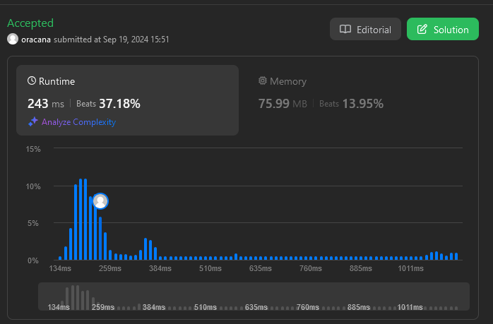

# Leet Code problem 912.Sort an Array
[Sort an Array](https://leetcode.com/problems/sort-an-array/description/)

## Constraints 
* Without using any built-in functions
* O(nlog(n)) time complexity
* Smallest space complexity possible.
* 1 <= nums.length <= 5 * 104
* -5 * 104 <= nums[i] <= 5 * 104

### Divide-and-Conquer Algorithm
* Divide the array into two halves
* Recursively sort each half
* Merge the sorted halves into a single, sorted array

1) Initialize three variables: i and j to keep track of the current indices in arr1 and arr2, respectively,and result to store the merged array.
2) Loop until one of the arrays is exhausted:
    *  Compare the current elements of arr1 and arr2. If arr2[j] is greater than arr1[i], push arr1[i] to the result array and increment i. 
    Otherwise, push arr2[j] to the result array and increment j.
3) Once one of the arrays is exhausted, append the remaining elements of the other array to the result array.

### Time Complexity = O(n log n)

* The mergeSort function recursively divides the array into two halves until the base case is reached, taking O(log n) time.

* The for loops used to copy elements to the left and right arrays take O(n) time.

* The merge function merges the two sorted halves into a single sorted array, taking O(n) time.

* Since the merge function is called recursively O(log n) times, the total time complexity of the mergeSort function is O(n log n) + O(n).

* We can drop the lower-order term O(n), leaving us with:

Best-case: O(n log n)
Average-case: O(n log n)
Worst-case: O(n log n)

### Space Complexity = O(n)
The algorithm creates temporary arrays to store the merged results, which requires additional memory proportional to the size of the input array.

